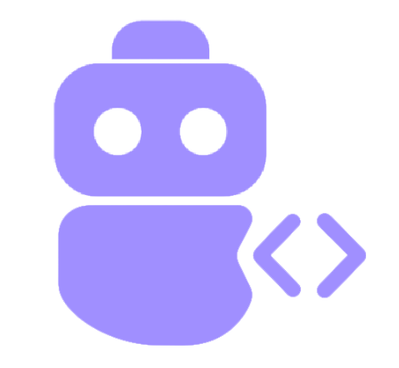

[](https://mseep.ai/app/augmentedstartups-visioncraft-mcp-server)

# VisionCraft MCP Server

<p align="center">
  
</p>

[](http://visioncraft-mcp.augmentedstartups.com/) [](https://github.com/augmentedstartups/VisionCraft-MCP-Server) [](https://claude.ai/download)

## 📺 VisionCraft MCP Demo

<p align="center">
  <a href="https://youtu.be/xs29B8zIT8U">
    
  </a>
</p>

## ❌ Without VisionCraft MCP

AI assistants struggle with computer vision and Gen-AI knowledge:

- ❌ Limited understanding of cutting-edge computer vision algorithms
- ❌ Outdated information on models released after training cutoff
- ❌ Generic answers that lack depth and technical accuracy
- ❌ No awareness of latest frameworks and tools

## ✅ With VisionCraft MCP

VisionCraft MCP delivers up-to-date, specialized computer vision and Gen-AI knowledge directly to Claude and other AI assistants.

- ✅ **Specialized knowledge** on state-of-the-art computer vision and Gen-AI
- ✅ **Up-to-date information** on the newest models and techniques
- ✅ **Detailed, technically accurate** responses to complex queries
- ✅ **Full awareness** of latest frameworks, tools, and best practices

## 🌟 VisionCraft vs. Context 7

While other context providers like Context 7 aim to supply LLMs with up-to-date documentation, VisionCraft offers distinct advantages for developers seeking precision, breadth, and efficiency. VisionCraft boasts access to over 100,000 libraries, all kept current in real-time through our proprietary Raven engine, ensuring you're always working with the latest information.

Beyond its powerful MCP server capabilities, VisionCraft is also available as a standalone AI on our platform, offering versatile access to its knowledge. A common challenge with some context providers is the tendency to inject extensive, sometimes overly broad, context into the LLM. This can lead to excessive token consumption, a particular concern for users of token-sensitive environments or APIs like those utilized by tools such as Cline. VisionCraft, in contrast, is engineered to deliver precisely the context you need. It provides highly accurate, real-time information, minimizing token usage and maximizing the relevance of the assistance you receive. This targeted approach ensures that you get the exact information required for your task without unnecessary overhead.


## How to use VisionCraft in your prompt.
Add `use visioncraft mcp` to your prompt in Claude:

```txt
Give me the code for OpenAI Agents SDK. Use visioncraft MCP tool.
```

VisionCraft MCP provides:

- 🔍 **Specialized Knowledge**: Access to state-of-the-art computer vision and GenAI information
- 🦅 **RAVEN Engine**: Advanced knowledge processing system that delivers precise, context-aware information
- 🚀 **Latest Algorithms**: Stay updated with cutting-edge models and techniques
- 💡 **Expert Guidance**: Get implementation advice from computer vision and GenAI specialists

## 🛠️ Getting Started

### Requirements

- Node.js >= v18.0.0
- Claude Desktop or another MCP-compatible client

### Install in MCP-compatible Clients (Claude Desktop, Cursor, Windsurf, VS Code/Cline)

Add the following configuration to your respective MCP settings file.
For Claude Desktop, this is typically `claude_desktop_config.json`.
For VS Code, you might use a general MCP configuration file or specific extension settings.
For Windsurf, Cursor, and other Cline-like tools, refer to their documentation for the MCP configuration location.


**Note:** While the command and arguments are generally the same, the top-level key for MCP servers might vary (e.g., `mcpServers` or `servers`). The example below uses `mcpServers`. Adjust if your specific client requires a different key (like `servers` for some VS Code setups).

```json
{
  "mcpServers": {
    "visioncraft": {
      "command": "npx",
      "args": ["-y", "visioncraft-mcp@latest", "--api-key", "YOUR_API_KEY_HERE"],
    }
  }
}
```
You will need an API key to use VisionCraft MCP. Get your free API key by signing up at [visioncraft-app.augmentedstartups.com](https://visioncraft-app.augmentedstartups.com/). For now, you can add it to your configuration as shown below.

### Demo: VisionCraft MCP in Action
#### Windsurf Integration

<p align="center">
  
  <br>
  <em>VisionCraft MCP in Windsurf</em>
</p>

#### VS Code Cline Integration

<p align="center">
  
  <br>
  <em>VisionCraft MCP in Cline</em>
</p>


## 🧠 Knowledge Base Coverage

Our knowledge base hosts over 100,000+ repositories, all updated in real-time. VisionCraft MCP provides expertise in Computer Vision and GenAI. This is thanks to our proprietary Raven engine.

## 🔍 Available Tools

- `vision-query`: Query the VisionCraft knowledge base for computer vision and GenAI information
  - `query` (required): The search query about computer vision topics

## 🗺️ Roadmap 

VisionCraft MCP is actively evolving. We are currently in a **free testing phase** as we build out our core functionalities and gather user feedback. Our goal is to provide a powerful tool for developers working with Computer Vision and GenAI.

**Currently Available:**
- [x] Access to a foundational knowledge base covering key Computer Vision and GenAI topics (Object Detection, Segmentation, 3D Vision, Vision-Language Models, Agentic Frameworks like OpenAI Agents SDK & CrewAI).
- [x] `vision-query` tool for direct information retrieval via MCP.
- [x] Easy integration with MCP-compatible clients (Claude Desktop, Cursor, Windsurf, VS Code/Cline).

**In Progress / Near Term:**
- [x] **Expanded Knowledge Domains**: Broadening coverage to include popular general programming frameworks, RAG-specific frameworks (e.g., LangChain, LlamaIndex), and other developer tools.
- [ ] **Enhanced Client Integration**: Deeper and more seamless integration with Claude Desktop, Cursor, and Windsurf, including client-specific optimizations and improved performance.
- [ ] **User Accounts & Personalized Experience**: Implementing mechanisms for user accounts and managing access, laying groundwork for personalized experiences.
- [ ] **Performance Optimizations**: Continuously improving response times and resource efficiency of the MCP server.

**Future Goals:**
- [ ] **Comprehensive Framework Support**: Aiming to cover a vast array of programming languages, libraries, and developer ecosystems.
- [ ] **Advanced RAG & Agentic Workflow Support**: Offering more sophisticated Retrieval Augmented Generation techniques and tools, along with support for building and understanding agentic workflows through the MCP.
- [ ] **Interactive Code Generation & Assistance**: Assisting with boilerplate code, debugging suggestions, and framework-specific snippets based on the expanded knowledge.
- [ ] **Custom Knowledge Base Integration**: Allowing users or enterprises to connect their own private knowledge bases for personalized assistance.

**Note:**
> VisionCraft MCP is currently **free** during development. We plan to introduce paid tiers in the future to support ongoing maintenance and expansion. Early users providing feedback will be valued as we shape our offerings.

## 📄 License

MIT License

## 🚀 About VisionCraft

VisionCraft helps developers build computer vision and GenAI applications using the latest and state-of-the-art algorithms, models, and frameworks. Our mission is to make advanced computer vision and GenAI technology accessible to developers of all skill levels.

Visit [VisionCraft](https://www.augmentedstartups.com/vision-craft-opt-in) to learn more.

---

Made with ❤️ by [Augmented AI](https://augmentedstartups.com)
